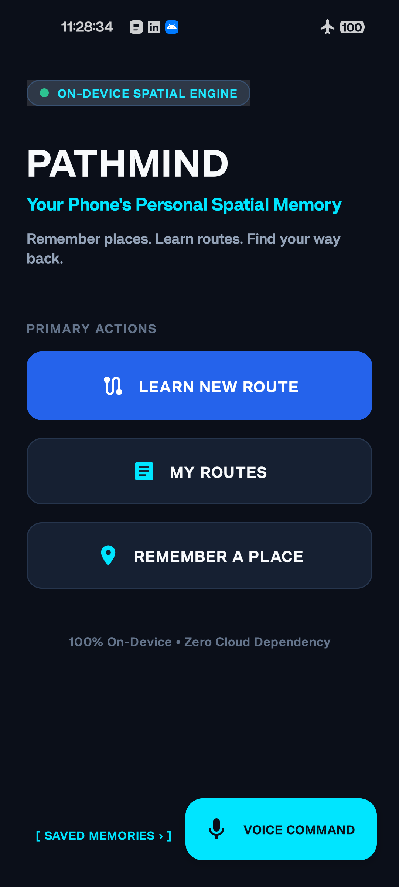
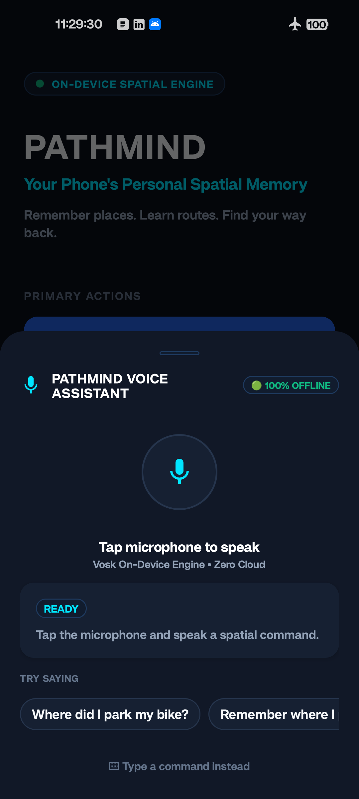
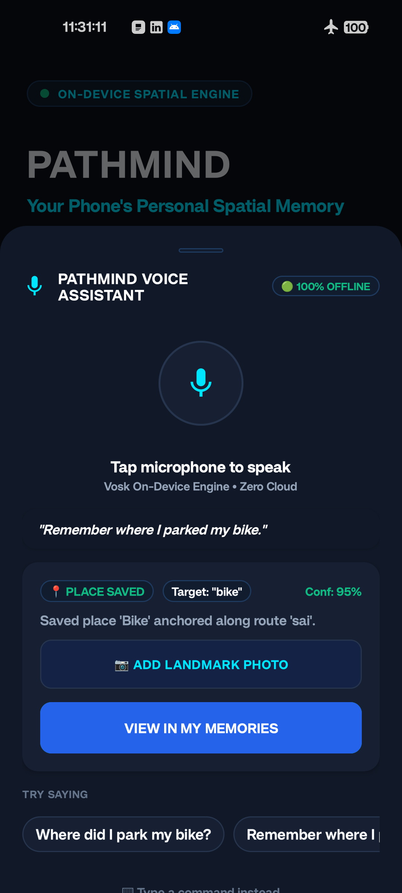
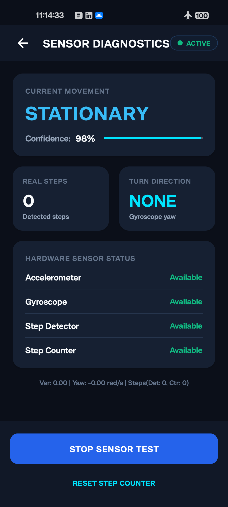
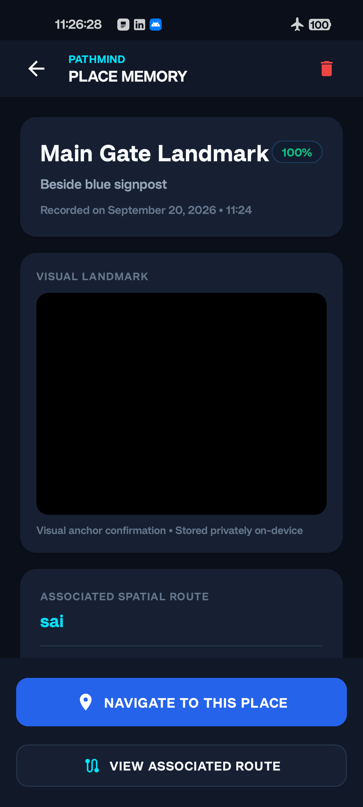
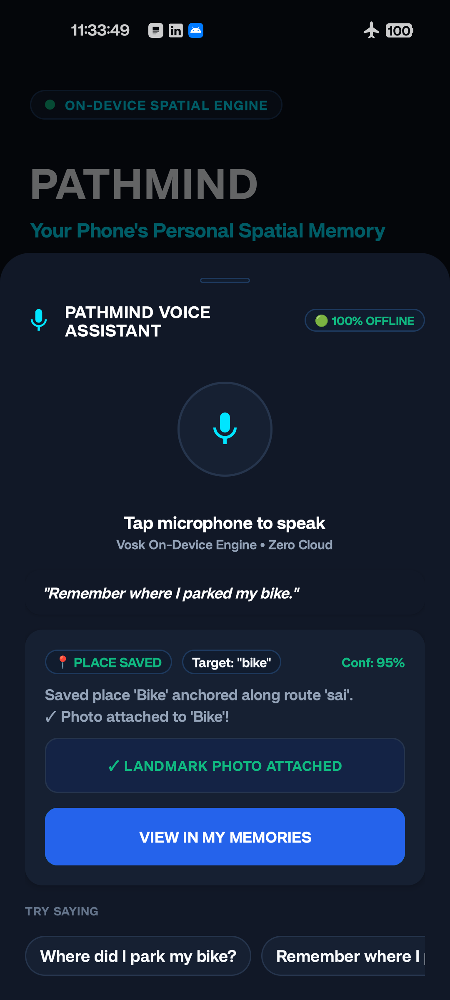

# PathMind
### *Your Phone's Personal Spatial Memory*

[](https://developer.android.com)
[](https://kotlinlang.org)
[](#16-privacy-and-offline-design)
[](LICENSE)
[](#22-testing-status)

> **PathMind** is an entirely on-device, dead-reckoning spatial memory and navigation assistant for Android. It enables users to record indoor and outdoor paths, anchor personal spatial memories (such as where they left their bike, bag, or desk), and navigate back step-by-step—**completely offline, without GPS, maps, or cloud infrastructure.**

---

## Visual Preview

| Home Screen | Offline Voice Assistant | Spatial Memory Anchoring |
| :---: | :---: | :---: |
|  |  |  |

| Saved Memories & Filters | Spatial Details & Route Anchor | Offline Navigation Prompt |
| :---: | :---: | :---: |
|  |  |  |

---

## Table of Contents
1. [Project Overview](#1-project-overview)
2. [Problem Statement](#2-problem-statement)
3. [Solution](#3-solution)
4. [Why PathMind is Different](#4-why-pathmind-is-different)
5. [Main Features](#5-main-features)
6. [How PathMind Works](#6-how-pathmind-works)
7. [Architecture](#7-architecture)
8. [Sensor-Based Route Learning](#8-sensor-based-route-learning)
9. [Personal Spatial Memory](#9-personal-spatial-memory)
10. [Offline Navigation](#10-offline-navigation)
11. [Deviation Detection and Recovery](#11-deviation-detection-and-recovery)
12. [On-Device AI / ML](#12-on-device-aiml)
13. [Offline Voice Intelligence](#13-offline-voice-intelligence)
14. [Optional Camera Landmark Capture](#14-optional-camera-landmark-capture)
15. [Smart Memory Retrieval](#15-smart-memory-retrieval)
16. [Privacy and Offline Design](#16-privacy-and-offline-design)
17. [Technology Stack](#17-technology-stack)
18. [Project Structure](#18-project-structure)
19. [Build Instructions](#19-build-instructions)
20. [How to Install / Run the APK](#20-how-to-install--run-the-apk)
21. [Demo Flow](#21-demo-flow)
22. [Testing Status](#22-testing-status)
23. [Known Limitations](#23-known-limitations)
24. [APK Download Section](#24-apk-download-section)
25. [License and Third-Party Information](#25-license-and-third-party-information)

---

## 1. Project Overview
Modern smartphone navigation is almost universally dependent on external signals: GPS satellites, cellular towers, Wi-Fi beacons, and cloud map servers. When a user enters a multi-level concrete parking garage, a basement lab, an indoor convention center, or a dense urban canyon where satellite signals attenuate, traditional navigation fails.

**PathMind** solves this problem by transforming the smartphone itself into an autonomous spatial dead-reckoning navigator. Using high-frequency motion sensor fusion, custom rotational noise filtering, an on-device neural classifier, and local offline speech recognition, PathMind lets users map paths and retrace their steps without sending a single byte of data over the internet.

---

## 2. Problem Statement
1. **GPS Denied Environments**: Satellite positioning does not work reliably indoors, in basements, underground parking structures, or dense metal/concrete buildings.
2. **Personal Object Disorientation**: Daily objects—such as parked bicycles, cars in unmarked lots, lab equipment, or desks—lack fixed geospatial coordinates on global maps.
3. **Privacy Concerns**: Cloud-based navigation platforms track and aggregate user movements, locations, and personal habits.
4. **Internet Dependency**: In remote transit zones, basements, or areas with poor cellular coverage, online assistants cannot process voice queries or load routes.

---

## 3. Solution
PathMind provides **relative spatial memory**. Instead of trying to establish global latitude and longitude, PathMind models paths as sequential dead-reckoning segments (`START` $\to$ `WALK` $\to$ `TURN` $\to$ `PAUSE` $\to$ `DESTINATION`). Objects are anchored to specific cumulative step offsets along those paths. When you need to find an item, PathMind guides you along the recorded route segment-by-segment using live step countdowns, turn indicators, and real-time deviation alerts.

---

## 4. Why PathMind is Different
| Feature | Traditional Navigation Apps | PathMind |
| :--- | :--- | :--- |
| **Connectivity** | Requires cellular data or Wi-Fi | **100% Offline** (Airplane Mode compatible) |
| **Indoor Operation** | Poor / Fails without GPS | **Native** (Runs on inertial sensors & dead reckoning) |
| **Personal Anchors** | Limited to map addresses | **Any relative spot** ("My Bike", "Locker 4", "Desk") |
| **Voice Processing** | Cloud servers (Google/Apple/Amazon) | **100% Local Vosk speech engine** (In-memory Kaldi) |
| **AI Inference** | Remote cloud LLMs/APIs | **On-Device TensorFlow Lite neural network** (0.05–0.10 ms latency) |
| **Privacy** | Location traces logged to cloud | **Zero network permission** (`android.permission.INTERNET` not present) |

---

## 5. Main Features
- 🚶 **Dead-Reckoning Route Learning**: Discretizes natural human walking into structured movement segments at 50 Hz.
- 🔄 **Noise-Immune Turn Detection**: Dynamic gravity alignment decouples vertical walking footfalls from rotational heading changes, rejecting natural arm sways ($< 0.35\text{ rad/s}$).
- 📍 **Personal Spatial Memory**: Anchor items to specific route segments and cumulative step positions.
- 🎙️ **Offline Voice Assistant**: Speak natural voice commands like *"Remember where I parked my bike"* or *"Where did I leave my bike?"* without internet.
- 🧠 **On-Device Neural Classifier**: 18-feature spatial ML model evaluating route deviation, drift, and recovery in real-time.
- ⚠️ **Deviation & Recovery Detection**: Detects wrong turns or step overshoots, prompting the user with turnaround instructions.
- 📷 **Optional Visual Landmark Capture**: Attach an optional photo cue to any remembered place; stored privately in internal sandbox storage.
- 🔍 **Fuzzy Memory Retrieval & Disambiguation**: Levenshtein-based matching, synonym alias dictionaries, and interactive multi-candidate disambiguation chips.

---

## 6. How PathMind Works
1. **Record**: As you walk, PathMind samples the device's accelerometer and gyroscope at 50 Hz. It detects steps, integrates yaw angles around the gravity vector, and segments your walk.
2. **Anchor**: When you reach a spot of interest, tell PathMind via voice or touch to remember it. PathMind creates a `PlaceMemory` anchored to that exact segment and step count.
3. **Retrieve**: Later, ask PathMind where the item is. Its local intent orchestrator searches your memory store using phonetic tolerance and route context affinity.
4. **Navigate**: PathMind slices the target route and guides you forward step-by-step with real-time feedback until you arrive.

---

## 7. Architecture
PathMind follows a modular, decoupled architecture consisting of four core layers:
- **Presentation Layer**: Material Design dark-themed activities, live telemetry monitors, and the hero microphone bottom sheet.
- **Intelligence Layer**: Offline Vosk speech recognizer, voice intent parser, fuzzy memory retrieval engine, and the on-device TensorFlow Lite spatial classifier.
- **Inertial Dead-Reckoning Layer**: High-frequency movement sensor engine, dynamic low-pass gravity filter, orthogonal yaw integrator, route learning engine, navigation engine, and deviation state machine.
- **Local Persistence Layer**: Sandboxed JSON file storage (`saved_routes.json`, `saved_memories.json`) and private landmark photo directory.

*For full technical diagrams and data flow details, see [docs/architecture.md](docs/architecture.md).*

---

## 8. Sensor-Based Route Learning
- **Gravity Isolation**: Uses an infinite impulse response (IIR) low-pass filter ($\alpha = 0.85$) to separate the static 1G gravity vector from dynamic forward footfalls and gait oscillations.
- **Gravity-Decoupled Yaw Integration**: Computes angular velocity directly projected along the estimated gravity unit vector ($\vec{\omega} \cdot \hat{g}$).
- **Turn Candidate Onset Timestamping**: When physical rotation begins, a `turnCandidateStartTime` is captured. Once the sustained rotational streak threshold is satisfied (15 samples, ~300 ms), the segment onset is anchored to the true beginning of the turn.
- **False Turn Suppression**: Candidate turns that cease before $800\text{ ms}$ are discarded as transient phone tilts or arm twitches and seamlessly collapsed back into the walk segment.

---

## 9. Personal Spatial Memory
A `PlaceMemory` contains:
- `id`: Unique identifier (UUID).
- `name`: Spoken or typed label (e.g., `"My Bike"`).
- `routeId`: ID of the route on which it was recorded.
- `segmentId`: Specific route segment where the item is anchored.
- `stepPosition`: Exact cumulative steps from the route start.
- `confidence`: Sensor confidence rating at the time of recording.
- `photoPath`: Optional private internal file path for visual verification.

---

## 10. Offline Navigation
When navigating to an anchored memory:
- **Route Slicing**: PathMind trims the original route to end at the target memory's anchor segment.
- **Step Countdown**: Displays expected remaining steps for each segment in real-time.
- **Canonical Arrival**: Flags arrival (`NavigationState.ARRIVED`) only when the target segment's step quota has actually been walked.
- **Clean Lifecycle**: Tapping **STOP NAVIGATION** or **EXIT NAVIGATION** halts sensor callbacks and frees CPU wake locks cleanly.

---

## 11. Deviation Detection and Recovery
PathMind continuously monitors walking progress against the expected route:
- **Step Overrun**: If step count exceeds segment expectation by $> 25\%$, triggers `POSSIBLE_DEVIATION`.
- **Heading Anomaly**: If integrated heading diverges from expected straight or turn actions, transitions to `CONFIRMED_DEVIATION`.
- **Recovery State**: When the user turns around and walks back toward the route heading, the state transitions to `RECOVERING` before resetting to `ON_ROUTE`.

---

## 12. On-Device AI / ML
PathMind embeds a custom-trained, genuine feedforward neural network running entirely on-device via TensorFlow Lite:

```
[18-D Motion Features] --> Dense(32, ReLU) --> Dense(16, ReLU) --> Dense(5, Softmax) --> [5 State Probabilities]
```

### Measured Specifications (Tested on realme RMX3750)
- **Input Features (18)**: Cadence (Hz), step variance, smoothed yaw rate, heading displacement, segment progress ratio, device pitch, roll, variance, and entropy.
- **Weights & Parameters**: **1,221 parameters**
- **Model File Size**: **5,052 bytes** (~4.93 KB)
- **Execution Engine**: TensorFlow Lite (CPU / NNAPI)
- **Inference Latency**: **0.05–0.10 ms** per step event (real-time sub-millisecond execution)
- **Synthetic Benchmark**: Achieved **99.75% accuracy on a held-out synthetic test set** during offline model validation.
  > *Note on Claim Accuracy: The 99.75% benchmark was measured on synthetic motion feature sets. It does not represent real-world navigation accuracy under arbitrary physical conditions.*

---

## 13. Offline Voice Intelligence
- **Engine**: Offline Vosk library with Kaldi acoustic feature processing.
- **Bundled Model**: `vosk-model-small-en-us-0.15` (41.2 MB compressed in assets).
- **Execution**: Runs in-memory without network connectivity.
- **Grammar Constraints**: Dynamically applies domain-specific JSON grammars to constrain acoustic decoding, maximizing transcription accuracy for navigation commands.
- **Privacy**: Audio is transcribed in RAM and immediately released. No audio recordings are ever written to disk or sent to the cloud.

---

## 14. Optional Camera Landmark Capture
- **Visual Cue**: Users may optionally take a single photo to serve as a visual landmark cue for a remembered place.
- **Sandboxed Storage**: Images are saved strictly in `context.filesDir/landmarks/` and are inaccessible to other applications.
- **Secondary Role**: The visual landmark is strictly an optional reference cue displayed on the navigation card. PathMind does **not** rely on continuous computer vision or cloud image recognition.

---

## 15. Smart Memory Retrieval
- **Levenshtein Typo Tolerance**: Tolerates phonetic inaccuracies and typos in voice transcriptions (e.g., `"bkie"` matches `"My Bike"`).
- **Synonym & Alias Engine**: Built-in dictionary maps synonyms (`"bicycle"` $\to$ `"bike"`, `"automobile"` $\to$ `"car"`).
- **Context Affinity**: Boosts candidate scores when a query specifies or occurs along a known route.
- **Disambiguation UI**: If multiple candidates score within 15 points, PathMind displays interactive chips for user selection.

---

## 16. Privacy and Offline Design
PathMind is built around strict data privacy principles:
- **No Internet Permission**: `android.permission.INTERNET` is **omitted** from [`AndroidManifest.xml`](app/src/main/AndroidManifest.xml).
- **Zero Cloud Infrastructure**: No remote servers, cloud databases, analytics SDKs, or third-party trackers exist in the project.
- **Airplane Mode Ready**: Fully functional with all wireless connections turned off.
- *For complete privacy details, see [docs/privacy.md](docs/privacy.md).*

---

## 17. Technology Stack
- **Language**: Kotlin 1.9+
- **Platform**: Android SDK 34 (Android 14) / Minimum SDK 26 (Android 8.0)
- **UI Framework**: AndroidX AppCompat, Material Components, ConstraintLayout
- **On-Device ML**: TensorFlow Lite Android Support (`org.tensorflow:tensorflow-lite:2.14.0`)
- **Speech Recognition**: Vosk Android SDK (`com.alphacephei:vosk-android:0.3.47`)
- **Build System**: Gradle 8.7 with Kotlin DSL

---

## 18. Project Structure
```
PATHMIND/
├── app/
│   ├── src/
│   │   ├── main/
│   │   │   ├── AndroidManifest.xml
│   │   │   ├── assets/
│   │   │   │   ├── pathmind_spatial_model.tflite    # On-device neural classifier (4.93 KB)
│   │   │   │   └── models/
│   │   │   │       └── vosk-model-small-en-us-0.15.zip # Bundled offline speech model (41.2 MB)
│   │   │   ├── java/com/example/pathmind/
│   │   │   │   ├── MainActivity.kt                  # Primary launch hub
│   │   │   │   ├── RouteLearningActivity.kt         # 50 Hz route recorder
│   │   │   │   ├── NavigationActivity.kt            # Dead-reckoning navigator + AI inspector
│   │   │   │   ├── RememberPlaceActivity.kt         # Place memory anchor form
│   │   │   │   ├── MyMemoriesActivity.kt            # Memory search, filter chips & list
│   │   │   │   ├── MyRoutesActivity.kt              # Saved routes overview
│   │   │   │   ├── RouteDetailsActivity.kt          # Route segment inspector
│   │   │   │   ├── SensorDebugActivity.kt           # Hardware diagnostics
│   │   │   │   ├── data/                            # Repositories & fuzzy retrieval
│   │   │   │   ├── model/                           # Domain entities & states
│   │   │   │   ├── sensor/                          # Dead reckoning & TFLite inference
│   │   │   │   ├── ui/                              # Adapters & VoiceCommandBottomSheet
│   │   │   │   ├── util/                            # Landmark image sandbox manager
│   │   │   │   └── voice/                           # Vosk speech & intent parser
│   │   │   └── res/                                 # Layouts, drawables, colors, strings
│   │   └── test/java/com/example/pathmind/          # 62 unit test suites
│   ├── build.gradle.kts
│   └── proguard-rules.pro
├── docs/
│   ├── architecture.md                              # Technical architecture specification
│   ├── demo-flow.md                                 # Step-by-step physical demonstration guide
│   ├── testing.md                                   # Unit test breakdown & hardware history
│   ├── privacy.md                                   # Data isolation & offline privacy model
│   └── screenshots/                                 # UI walkthrough screenshots
├── tools/
│   └── train_spatial_model.py                       # ML model training & TFLite export script
├── build.gradle.kts
├── settings.gradle.kts
├── gradlew & gradlew.bat
└── README.md
```

---

## 19. Build Instructions

### Prerequisites
- **JDK**: Java 17 or Java 21 (configured in `JAVA_HOME`)
- **Android SDK**: Build Tools 34.0.0, Platform SDK 34

### Building from Command Line
```bash
# Clone the repository
git clone https://github.com/SriramBoddu123/PathMind.git
cd PathMind

# Run all 62 unit tests
./gradlew testDebugUnitTest

# Assemble the debug APK
./gradlew assembleDebug
```
The compiled APK will be located at:
```
app/build/outputs/apk/debug/app-debug.apk
```

---

## 20. How to Install / Run the APK
Connect your Android phone via USB with **USB Debugging** enabled:
```bash
# Install preserving existing data
adb install -r -d app/build/outputs/apk/debug/app-debug.apk

# Launch PathMind
adb shell am start -n com.example.pathmind/.MainActivity
```

---

## 21. Demo Flow
1. **Learn Route**: Tap **LEARN NEW ROUTE** $\to$ walk forward 15 steps $\to$ turn right $\to$ walk 10 steps $\to$ tap **STOP & SAVE** as `"Garage Route"`.
2. **Remember Place**: Tap cyan **VOICE COMMAND** button $\to$ speak *"Remember where I parked my bike"* $\to$ PathMind anchors `"My Bike"` along the route.
3. **Retrieve & Navigate**: Walk away $\to$ tap **VOICE COMMAND** $\to$ speak *"Where did I park my bike?"* $\to$ tap **NAVIGATE TO MY BIKE**.
4. **Follow Guidance**: Follow live step countdowns, directional banners, and real-time AI Model Inspector probabilities until reaching **ARRIVED**.
*For detailed instructions, see [docs/demo-flow.md](docs/demo-flow.md).*

---

## 22. Testing Status
- **Automated Unit Tests**: **62 / 62 Passing (100%)**
  - Covers sensor filters, turn debounce, candidate onset timing, intent extraction, and fuzzy scoring.
- **Physical Device Verification**: Extensively tested on physical hardware (**realme RMX3750, Android 14**).
- *See [docs/testing.md](docs/testing.md) for complete verification records.*

---

## 23. Known Limitations
- **Relative Dead Reckoning**: PathMind measures distance via steps and heading via integrated gyroscope yaw. It does not provide global GPS coordinates.
- **Handset Attitude**: For optimal turn detection, hold the phone naturally in hand or front pocket while walking; rapid random tumbling or swinging may temporarily reduce turn confidence.
- **First-Launch Voice Setup**: On first cold start, the bundled 41.2 MB Vosk model takes approximately 1.5–2.0 seconds to extract to internal storage. Subsequent launches load natively in ~50 ms.

---

## 24. APK Download Section
Pre-built prototype APK binaries are available on the [GitHub Releases](https://github.com/SriramBoddu123/PathMind/releases) page:
- **Download**: [`app-debug.apk`](https://github.com/SriramBoddu123/PathMind/releases) (~71.69 MB)
- **SHA-256**: Verified at build time.

---

## 25. License and Third-Party Information
- **PathMind Codebase**: Licensed under the Apache License 2.0.
- **Vosk Acoustic Model**: `vosk-model-small-en-us-0.15` is distributed under the Apache 2.0 License by [Alphacephei](https://alphacephei.com/vosk/).
- **TensorFlow Lite**: Distributed by Google under the Apache 2.0 License.
